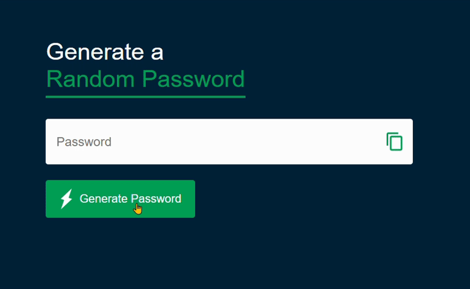

# Random Password Generator 🔐

## Overview
"Random Password Generator" is a web application that allows users to generate secure and random passwords. The application provides a user-friendly interface with the ability to create and copy passwords.

## Technologies Used 🚀
- HTML
- CSS
- JavaScript

## Installation 💻
No special installation is required for this project. Simply download the project files and open the index.html file in a web browser.

## Usage 💬
1. Generate Password:
    - Click the "Generate Password" button to create a random password.
2. Copy Password:
    - Once a password is generated, it will be displayed in the input field.
    - Click the copy icon to copy the generated password to the clipboard.

    

## Features ✨
- Random Password Generation: Create strong passwords with a mix of uppercase, lowercase, numbers, and symbols.
- Copy to Clipboard: Easily copy the generated password for immediate use.

## Live Demo 🌐
- Live Demo: [Password Generator](https://password-generator-theta-dun.vercel.app/)

## Contributing 🤝
Feel free to use, modify, and contribute to the project! If you have any questions or feedback, you can reach me at nisagokdemir@gmail.com. Happy password generating!

## License
This project is licensed under the MIT License.